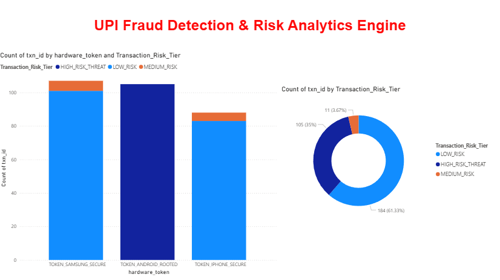

# UPI Fraud Detection & Transaction Risk Analytics Engine

An enterprise-grade financial data engineering and risk intelligence platform built to ingest, monitor, and evaluate concurrent Peer-to-Peer (P2P) financial transfers at scale. The architecture deploys multi-layered computational rule engines to identify distributed bad actors and tag operational threat vectors before network settlement.

---

## Core Business Problem & Objective

As transactional density scales across unified payment networks, downstream batched auditing fails to trap high-velocity fraud bursts. Financial networks require predictive real-time risk scoring parameters to analyze inbound payload markers. 

This platform programmatically flags:
- **Velocity Threshold Controls:** Tracking immediate transaction bursts from a single customer profile within thin execution windows.
- **Volumetric Ticket Spikes:** Detecting massive shifts from a profile's historical median transaction values (e.g., tickets escalating to ₹45,000–₹75,000).
- **Device Vulnerability Mapping:** Identifying security posture anomalies via compromised, rooted, or jailbroken hardware token indicators (`TOKEN_ANDROID_ROOTED`).

---

## Operational Risk Dashboards

Below is the live operational dashboard deployment segregating platform volume into conditional risk tiers and isolating compromised device signatures:



---

## Production Technology Stack

* **Database Architecture Layer:** MySQL Server 8.0+ (Relational Star Schema with optimized index structures for sub-second query performance).
* **Data Engineering & ETL Ingestion:** Python 3.x (Dynamic data pipeline automating dimensional seeding and simulating adversarial fraud injection streams).
* **Semantic Rule Engine:** Power BI Enterprise (Advanced DAX logical column tiering and relational data mapping).

---

## Relational Data Modeling (Star Schema)

The analytical data warehouse segregates reporting workloads from production environments to prevent query degradation on live transaction logs:

* **FACT TRANSACTION LEDGER (`fact_transactions`):** Ingests unique transactional IDs, relational foreign keys, operational timestamps, currency values, and spatial markers.
* **CONFORMED DIMENSIONS:**
  * `dim_customer`: Maintains temporal onboarding markers and core baseline risk segmentation.
  * `dim_device`: Tracks physical hardware signatures, operating system revisions, and hardware rooting flags.
  * `dim_merchant`: Maintains business vertical taxonomy and systemic historical chargeback performance parameters.

---

## Multi-Layered Semantic Rule Logic (DAX Implementation)

To continuously segregate structural transfer volumes without modifying underlying operational transaction records, an advanced conditional risk tiering layer is executed within the Power BI semantic layer:

```dax
Transaction_Risk_Tier = 
IF(
    'fact_transactions'[amount] >= 40000 && 'fact_transactions'[transaction_status] = "SUSPENDED",
    "HIGH_RISK_THREAT",
    IF('fact_transactions'[transaction_status] = "FAILED", "MEDIUM_RISK", "LOW_RISK")
)

### How to Run the Project

1. **Database Setup:**
   [cite_start]Run the `upi_risk_analytics.sql` script in your MySQL instance to create the tables and indexes.

2. **Data Pipeline (Ingestion):**
   Install dependencies and run the Python script to seed the database dimensions and generate synthetic transaction streams:
   ```bash
   pip install mysql-connector-python
   python upi_fraud_loader_risk_analytics.py
